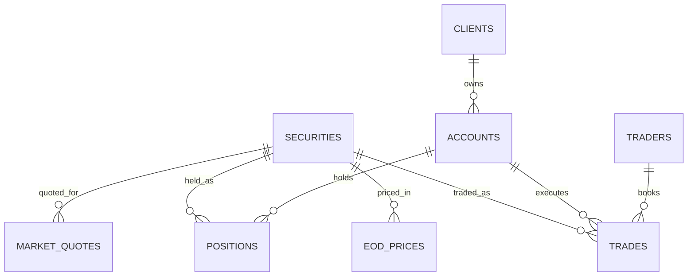

# Fabric Capital Markets Demo Dataset

Synthetic **Capital Markets** dataset generator for **Microsoft Fabric** demos.
Produces 8 related CSV files covering equity trading, market quotes, and client
positions — ready to load into a Fabric Lakehouse as Delta tables.

## Tables

| Table | Type | Rows (small) | Description |
|---|---|---|---|
| `securities` | dimension | 100 | Equity master (symbol, ISIN, sector, exchange) |
| `clients` | dimension | 1,000 | Institutional & retail clients |
| `accounts` | dimension | 1,500 | Brokerage/custody accounts |
| `traders` | dimension | 20 | Internal trading desk personnel |
| `eod_prices` | fact | ~26K | Daily OHLCV per security |
| `trades` | fact | 50,000 | Executed trades |
| `market_quotes` | fact (streaming) | 200,000 | Intraday bid/ask quotes (last 5 trading days) |
| `positions` | fact (snapshot) | ~10K | Current holdings per account |

## Entity Relationships



### Foreign Keys

| Child | Column → Parent | Cardinality |
|---|---|---|
| `accounts.client_id` | → `clients.client_id` | many-to-one |
| `trades.account_id` | → `accounts.account_id` | many-to-one |
| `trades.symbol` | → `securities.symbol` | many-to-one |
| `trades.trader_id` | → `traders.trader_id` | many-to-one |
| `eod_prices.symbol` | → `securities.symbol` | many-to-one |
| `market_quotes.symbol` | → `securities.symbol` | many-to-one |
| `positions.account_id` | → `accounts.account_id` | many-to-one |
| `positions.symbol` | → `securities.symbol` | many-to-one |

**Composite keys**

- `eod_prices` → (`symbol`, `trade_date`)
- `positions` → (`as_of_date`, `account_id`, `symbol`)

## Quick Start

```powershell
# Clone
git clone https://github.com/pratpat/fabric-capital-markets-demo.git
cd fabric-capital-markets-demo

# Generate (uses only the Python stdlib — no pip install needed)
python generate_data.py --scale small --out data
```

### Scale options

| Scale | Securities | Clients | Trades | Quotes | Total Size |
|---|---|---|---|---|---|
| `small` | 100 | 1K | 50K | 200K | ~19 MB |
| `medium` | 500 | 10K | 1M | 2M | ~400 MB |
| `large` | 1,500 | 50K | 5M | 10M | ~2 GB |

```powershell
python generate_data.py --scale medium --out data
python generate_data.py --scale large  --out data
```

## Loading into Microsoft Fabric

### Option 1 — OneLake File Explorer (drag & drop)
1. Install OneLake file explorer for Windows.
2. Drag the `data/` folder into your Lakehouse `Files/raw/` location.

### Option 2 — Fabric Notebook (PySpark → Delta tables)

```python
tables = ["securities","clients","accounts","traders",
          "eod_prices","trades","market_quotes","positions"]

for t in tables:
    (spark.read
        .option("header", True)
        .option("inferSchema", True)
        .csv(f"Files/raw/{t}.csv")
        .write.mode("overwrite")
        .saveAsTable(t))
```

### Option 3 — Fabric Data Pipeline
Use a **Copy activity** with the CSV files as source and Lakehouse table as
destination. Recommended for the `large` scale.

## Suggested Demo Scenarios

| Fabric workload | Dataset to use |
|---|---|
| **Eventstream + Eventhouse (KQL)** | `market_quotes` (streaming tick data) |
| **Lakehouse — Bronze/Silver/Gold** | `trades` → cleansed → aggregated PnL |
| **Data Warehouse** | `clients`, `accounts`, `positions` (relational reporting) |
| **Data Science (notebooks)** | VaR / anomaly detection on `trades` |
| **Power BI Direct Lake** | Trader PnL, exposure by sector |
| **Purview / governance** | PII on `clients`, MNPI on `trades` |

## Notes

- All data is **synthetic** (seeded with `random.seed(42)` for reproducibility).
- Referential integrity is guaranteed across all FKs.
- `market_quotes` covers the last **5 trading days** only (streaming-style).
- `eod_prices` is dense: every (symbol × business-day) pair is present.

## License

[MIT](LICENSE)
