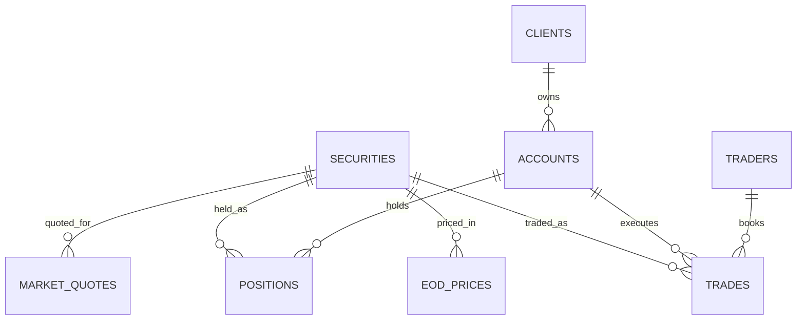

# Fabric Capital Markets Demo Dataset

Synthetic **Capital Markets** dataset generator for **Microsoft Fabric** demos.
Produces 8 related CSV files covering equity trading, market quotes, and client
positions — ready to load into a Fabric Lakehouse as Delta tables.

## Tables

| Table | Type | Rows (small) | Description |
|---|---|---|---|
| `securities` | dimension | 100 | Equity master (symbol, ISIN, sector, exchange) |
| `clients` | dimension | 1,000 | Institutional & retail clients |
| `accounts` | dimension | 1,500 | Brokerage/custody accounts |
| `traders` | dimension | 20 | Internal trading desk personnel |
| `eod_prices` | fact | ~26K | Daily OHLCV per security |
| `trades` | fact | 50,000 | Executed trades |
| `market_quotes` | fact (streaming) | 200,000 | Intraday bid/ask quotes (last 5 trading days) |
| `positions` | fact (snapshot) | ~10K | Current holdings per account |

## Entity Relationships



### Foreign Keys

| Child | Column → Parent | Cardinality |
|---|---|---|
| `accounts.client_id` | → `clients.client_id` | many-to-one |
| `trades.account_id` | → `accounts.account_id` | many-to-one |
| `trades.symbol` | → `securities.symbol` | many-to-one |
| `trades.trader_id` | → `traders.trader_id` | many-to-one |
| `eod_prices.symbol` | → `securities.symbol` | many-to-one |
| `market_quotes.symbol` | → `securities.symbol` | many-to-one |
| `positions.account_id` | → `accounts.account_id` | many-to-one |
| `positions.symbol` | → `securities.symbol` | many-to-one |

**Composite keys**

- `eod_prices` → (`symbol`, `trade_date`)
- `positions` → (`as_of_date`, `account_id`, `symbol`)

## Quick Start

```powershell
# Clone
git clone https://github.com/pratpat/fabric-capital-markets-demo.git
cd fabric-capital-markets-demo

# Generate (uses only the Python stdlib — no pip install needed)
python generate_data.py --scale small --out data
```

### Scale options

| Scale | Securities | Clients | Trades | Quotes | Total Size |
|---|---|---|---|---|---|
| `small` | 100 | 1K | 50K | 200K | ~19 MB |
| `medium` | 500 | 10K | 1M | 2M | ~400 MB |
| `large` | 1,500 | 50K | 5M | 10M | ~2 GB |

```powershell
python generate_data.py --scale medium --out data
python generate_data.py --scale large  --out data
```

## Onboarding — Load into Microsoft Fabric Lakehouse

> Prerequisite: a Fabric workspace with a Lakehouse (create one via
> **Workspace → + New → Lakehouse**).

Pick **one** of the four options below.

### Option 1 — OneLake File Explorer (drag & drop) — easiest
1. Install **[OneLake File Explorer for Windows](https://www.microsoft.com/en-us/download/details.aspx?id=105222)**.
2. Sign in with your Fabric account. Your Lakehouse appears as a folder in Windows Explorer.
3. Drag `data/` from this repo into `<Workspace>\<Lakehouse>.Lakehouse\Files\raw\`.
4. In the Fabric portal: **Lakehouse → Files → raw** → right-click each CSV → **Load to Tables → New table**.

### Option 2 — Upload via the Fabric portal
1. Open your Lakehouse in Fabric.
2. **Files → New folder** → name it `raw`.
3. **Upload → Upload files** → select all 8 CSVs from `data/`.
4. Right-click each file → **Load to Tables → New table**.

### Option 3 — PySpark Notebook (recommended; reproducible & typed) ⭐
1. Fabric portal → **+ New → Notebook**.
2. In the notebook, click **Add Lakehouse** (left pane) → select your Lakehouse.
3. Ensure the CSVs are in `Files/raw/` (use Option 1 or 2 to upload them).
4. **Import notebook** → upload [`notebooks/01_load_csv_to_delta.ipynb`](notebooks/01_load_csv_to_delta.ipynb).
5. **Run all** — creates 8 Delta tables with proper schemas and runs a sanity-check query.

### Option 4 — Pull straight from GitHub (no upload step)
Run inside a Fabric notebook attached to your Lakehouse:

```python
import requests, os
BASE = "https://raw.githubusercontent.com/pratpat/fabric-capital-markets-demo/main/data"
files = ["securities","clients","accounts","traders",
         "eod_prices","trades","market_quotes","positions"]

local = "/lakehouse/default/Files/raw"
os.makedirs(local, exist_ok=True)
for f in files:
    r = requests.get(f"{BASE}/{f}.csv"); r.raise_for_status()
    open(f"{local}/{f}.csv", "wb").write(r.content)
    print(f"downloaded {f}.csv")
```

Then execute the load cell from [`notebooks/01_load_csv_to_delta.ipynb`](notebooks/01_load_csv_to_delta.ipynb).

### Option 5 — Fabric Data Pipeline
For `medium` / `large` scales, use a **Copy data** activity:
- Source: HTTP / GitHub raw URLs (or uploaded files in OneLake)
- Sink: Lakehouse table

## Verify the Load

After loading, run in the Lakehouse SQL endpoint or a notebook:

```sql
SELECT s.sector,
       COUNT(*)              AS trade_count,
       ROUND(SUM(t.notional),2) AS total_notional_usd
FROM   trades t
JOIN   securities s ON s.symbol = t.symbol
GROUP  BY s.sector
ORDER  BY total_notional_usd DESC;
```

You should see ~50K trades distributed across all 11 sectors.

## Create Ontology in Fabric IQ

Once tables are loaded into the Lakehouse, model them as a business ontology
in **Fabric IQ** to enable Copilot Q&A, semantic search, and reusable
business definitions across reports.

> Fabric IQ ontology authoring is accessed from your workspace's **OneLake
> catalog → Ontology** (or **Fabric IQ Studio** in some tenants). Menu names
> may vary by tenant rollout.

### Concepts (Classes)

| Concept | Backing Table / Column | Description |
|---|---|---|
| **Security** | `securities` | Tradable financial instrument |
| **Sector** | `securities.sector` (distinct values) | GICS-style sector taxonomy |
| **Industry** | `securities.industry` (distinct values) | Sub-classification of Sector |
| **Exchange** | `securities.exchange` (distinct values) | Listing venue |
| **Client** | `clients` | Counterparty |
| **Account** | `accounts` | Brokerage/custody account |
| **Trader** | `traders` | Internal trader |
| **Desk** | `traders.desk` (distinct values) | Trading desk grouping |
| **Trade** | `trades` | Executed transaction (event) |
| **Quote** | `market_quotes` | Bid/ask snapshot (event) |
| **Position** | `positions` | Holding snapshot (state) |
| **PriceObservation** | `eod_prices` | Daily OHLCV record |

### Relationships (Object Properties)

| Relationship | From → To | Backing FK | Cardinality |
|---|---|---|---|
| `belongsToSector` | Security → Sector | `securities.sector` | many-to-one |
| `inIndustry` | Security → Industry | `securities.industry` | many-to-one |
| `listedOn` | Security → Exchange | `securities.exchange` | many-to-one |
| `owns` | Client → Account | `accounts.client_id` | one-to-many |
| `worksOnDesk` | Trader → Desk | `traders.desk` | many-to-one |
| `executedBy` | Trade → Trader | `trades.trader_id` | many-to-one |
| `executedFor` | Trade → Account | `trades.account_id` | many-to-one |
| `tradedSecurity` | Trade → Security | `trades.symbol` | many-to-one |
| `quotedSecurity` | Quote → Security | `market_quotes.symbol` | many-to-one |
| `holdsSecurity` | Position → Security | `positions.symbol` | many-to-one |
| `inAccount` | Position → Account | `positions.account_id` | many-to-one |
| `pricedSecurity` | PriceObservation → Security | `eod_prices.symbol` | many-to-one |
| `tradesFor` *(derived)* | Trader → Client | via `trades` → `accounts` | many-to-many |
| `hasExposureTo` *(derived)* | Client → Sector | via `positions` → `securities` | many-to-many |

### Attributes — mark as Measure / Time

| Concept | Attribute | Tag |
|---|---|---|
| Client | `aum_usd` | Measure |
| Trade | `quantity`, `price`, `notional` | Measure |
| Trade | `trade_ts` | Time |
| Position | `quantity`, `market_value_usd`, `unrealized_pnl_usd` | Measure |
| Position | `as_of_date` | Time |
| Quote | `bid`, `ask`, `bid_size`, `ask_size` | Measure |
| Quote | `quote_ts` | Time |
| PriceObservation | `open`, `high`, `low`, `close`, `volume` | Measure |
| PriceObservation | `trade_date` | Time |

**Derived measures to add:**
- `Quote.spread = ask - bid`
- `Position.weight_pct = market_value_usd / SUM(market_value_usd) OVER (account_id)`

### Hierarchies

| Hierarchy | Levels |
|---|---|
| **Instrument** | Sector → Industry → Security |
| **Geography** | Region → Country (map: US/CA → AMER · GB/DE/FR/CH/NL → EMEA · JP/HK/SG/AU/IN → APAC · BR → LATAM) |
| **Org** | Region → Desk → Trader |
| **Time** | Year → Quarter → Month → Date (apply to `trade_ts`, `quote_ts`, `as_of_date`, `trade_date`) |

### Synonyms (improves Copilot natural-language Q&A)

| Concept / Attribute | Synonyms |
|---|---|
| Security | instrument, ticker, stock, equity |
| Trade | execution, fill, transaction |
| `notional` | trade value, gross value, dollar volume |
| Position | holding, inventory |
| Client | counterparty, customer, account holder |
| `aum_usd` | assets under management, AUM |

### Authoring Steps in Fabric IQ

1. **Open Fabric IQ** in your workspace → **+ New ontology** → name it
   `capital_markets_ontology`.
2. **Bind data source** → select your Lakehouse → choose all 8 Delta tables.
3. **Add concepts** — for each row in the *Concepts* table above:
   click **+ Add concept** → set the **backing table** → pick the **business
   key** (`symbol`, `client_id`, `account_id`, `trader_id`, `trade_id`).
4. **Promote derived concepts** — for `Sector`, `Industry`, `Exchange`,
   `Desk`: **+ Add concept** → backing **column** of the parent table
   (distinct values).
5. **Create relationships** — for each row in the *Relationships* table:
   **+ Add relationship** → choose *from concept*, *to concept*, *FK
   column*, *cardinality*.
6. **Tag measures & dates** — open each concept → set **Measure** /
   **Time** tags per the *Attributes* table.
7. **Build hierarchies** — concept → **+ Hierarchy** → add levels per the
   *Hierarchies* table.
8. **Add synonyms** — concept/attribute → **Synonyms** → paste from list.
9. **Add derived relationships** (`tradesFor`, `hasExposureTo`) as
   **calculated relationships** through bridge tables.
10. **Validate & Publish** — run the built-in validator → **Publish**.
    The ontology is now queryable by Copilot in Fabric and consumable by
    Power BI semantic models.

### Verify the Ontology

Try these natural-language questions in Copilot once published:

- *"Which sectors had the highest notional traded last week?"*
- *"Show me top 10 clients by AUM in EMEA."*
- *"Which trader has the largest exposure to Technology?"*
- *"What is the average bid-ask spread for XNAS-listed securities today?"*
- *"List unrealized PnL by client and sector."*

## Next Steps After Loading

1. **Define relationships** in the Lakehouse SQL endpoint default semantic model
   (Model view → drag FK columns onto PK columns) — see [Foreign Keys](#foreign-keys) above.
2. **Build a Direct Lake Power BI report** on top of the semantic model.
3. **Stream `market_quotes`** through an Eventstream → Eventhouse for the
   real-time analytics demo.
4. **Add governance** — apply Purview sensitivity labels to `clients` (PII)
   and `trades` (MNPI).

## Suggested Demo Scenarios

| Fabric workload | Dataset to use |
|---|---|
| **Eventstream + Eventhouse (KQL)** | `market_quotes` (streaming tick data) |
| **Lakehouse — Bronze/Silver/Gold** | `trades` → cleansed → aggregated PnL |
| **Data Warehouse** | `clients`, `accounts`, `positions` (relational reporting) |
| **Data Science (notebooks)** | VaR / anomaly detection on `trades` |
| **Power BI Direct Lake** | Trader PnL, exposure by sector |
| **Purview / governance** | PII on `clients`, MNPI on `trades` |

## Notes

- All data is **synthetic** (seeded with `random.seed(42)` for reproducibility).
- Referential integrity is guaranteed across all FKs.
- `market_quotes` covers the last **5 trading days** only (streaming-style).
- `eod_prices` is dense: every (symbol × business-day) pair is present.

## License

[MIT](LICENSE)
